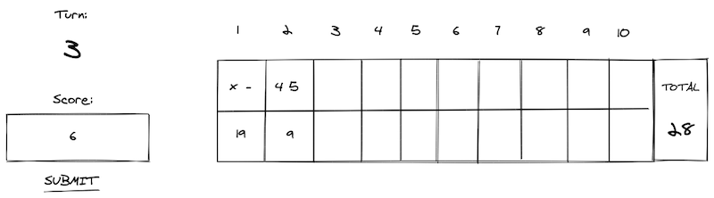
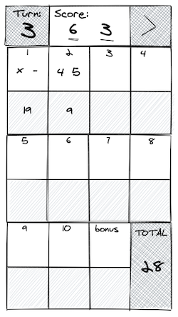

# Bowling-Challenge #

The screens are down at the local bowling alley and this programme is here to help you keep track of your score so you can still play the game. It's a one-player score card, so each player will need to run their own app.

*Tech used*

I created this programme as part of a challenge at [Makers Academy](https://github.com/makersacademy). See [Specification](#Specification) for more information on the programme's requirements, and [How I built it](#How-i-built-it) for an insight into my planning.


* [Getting started](#Getting-Started)
* [Useage](#useage)
* [Running tests](#Running-tests)
* [Specification](#Specification)
* [How I built it](#How-i-built-it)
* [Credits](#credits)


## Getting Started ##

1. Fork this repo, and clone to your local machine. Navigate into the folder.
2. Open `index.html` in your browser

## How to play ##

### Scoring ###

There are 10 turns(frames) in a game. In each game you get two rolls. Enter your two rolls and click to submit. The scorecard will store your rolls and calculate your score using the following rules.

In [traditional scoring](https://en.wikipedia.org/wiki/Ten-pin_bowling#Traditional_scoring), one point is scored for each pin that is knocked over, and when less than all ten pins are knocked down in two rolls in a frame, the frame is scored with the total number of pins knocked down. However, when all ten pins are knocked down with either the first or second rolls of a frame, bonus pins are awarded as follows:

- **Strike:** When all ten pins are knocked down on the first roll (marked "X" on the scoresheet), the frame receives ten pins plus a bonus of pinfall on the next two rolls (not necessarily the next two frames). A strike in the tenth (final) frame receives two extra rolls for bonus pins.

- **Spare:** When a second roll of a frame is needed to knock down all ten pins (marked "/" on the scoresheet), the frame receives ten pins plus a bonus of pinfall in the next roll (not necessarily the next frame). A spare in the first two rolls in the tenth (final) frame receives a third roll for bonus pins.

### Special games ###

- **Gutter game**: when the player never hits a pin (20 zero scores)
- **Perfect game**: when the player rolls 12 strikes (10 regular strikes and 2 strikes for the bonus in the 10th frame). The Perfect Game scores 300 points.

## Running tests ##

1. Open `SpecRunner.html` in your browser

## Specification ##

See original challenge instructions [here](Challenge-instructions.md)

### User Stories ###

Developed from challenge instructions.​

```
As a bowler,
To keep track of my scores,
I would like to input a score

As a bowler,
To complete a turn,
I would like to enter two rolls

As a bowler,
To keep track of my score,
I would like to see the total score for each turn

As a bowler,
To score a stike correctly,
I would to add the next two scores to my strike turn

As a bowler,
To score a spare correctly,
I would to add the next score to my strike turn

As a bowler,
To keep track of my score,
I would like to see my total

As a bowler,
To complete a game,
I would like to have ten turns

As a bowler,
To get as many points as possible,
I would like to have a bonus roll if I score 10 on the 10th turn
```

## How I built it ##

### Objects ###

I roughly diagrammed each object required, its attributes, methods and events needed.


  | 1            |**Game**|
  |--------------|--------|
  |**Attributes**|turn    |
  |**Methods**   |play    |
  
  

  | 2             |**Frame**|        |          |     | 
  |---------------|---------|--------|----------|-----|
  |**Attributes**|roll1    |roll2   |totalScore|bonus|
  |**Methods**   |getRolls |getScore|Strike    |Spare|

  

  | 3             |**Scorecard**|          |
  |---------------|-------------|          |
  |**Attributes** |score        |turn      |
  |**Methods**    |outputScore  |enterScore|

  

  |4          |**Interface**|          |
  |-----------|-------------|----------|
  |**Events** |clickSubmit  |finish    |
  |**Methods**|updateScore  |updateTurn|

### Designing Tests 

When planning my code I thought about the tests I might need, and tried to order them by simplicity.

#### Feature tests

- One frame
- Multiple frames
- Gutter game
- Spares
- Strikes
- Final Frame

#### Unit tests

### Thinking about UI

When planning out user interaction and the scoring system, it was helpful to roughly sketch out the UI. Mobile design developed for fun (and an additional challenge).

#### Score card and user input

User enters scores and clicks submit. Interface updates turn, prints rolls and calculates score.



#### Mobile UI

Scorecard and user-input arranged to 7x4 grid.



## Credits

User stories and initial UI design developed in a brain storming session with fellow Makers coder [David McGregor](https://github.com/davmcgregor/)